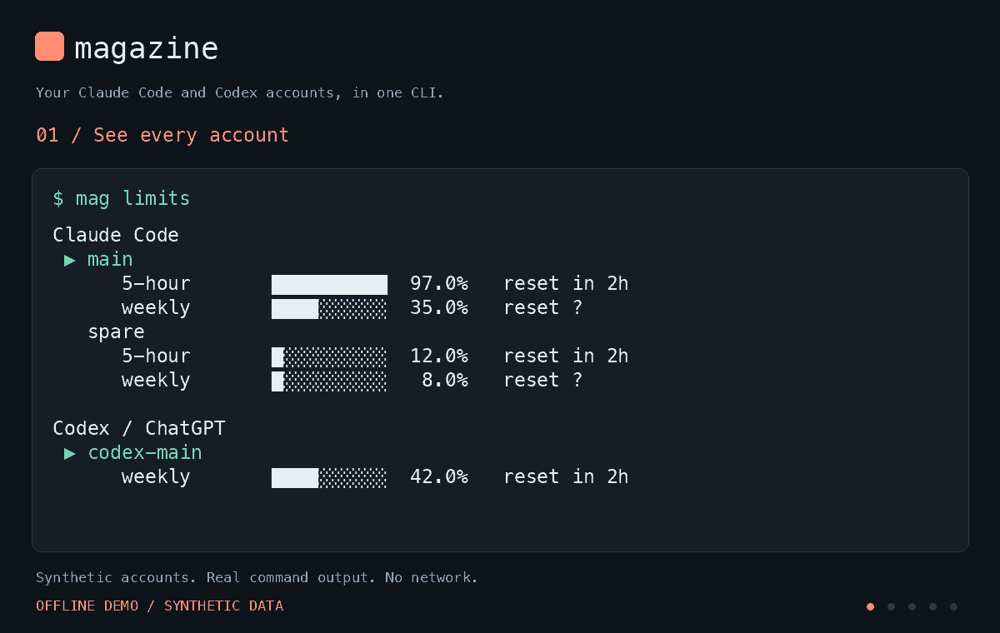

# magazine

**Your Claude Code and Codex accounts, in one CLI.**

Check usage across your subscriptions, switch accounts by name, and find Claude Code
sessions interrupted by a limit. Built for developers who already manage multiple
accounts of their own.

[](https://github.com/shirakawayohane/magazine/actions/workflows/test.yml)
[](LICENSE)
[Install](#install) · [Quick start](#quick-start) · [Guide](docs/guide.md) · [Report a bug](https://github.com/shirakawayohane/magazine/issues/new/choose)



*Real magazine commands with synthetic accounts and usage data. The final step is a
resume preview, not a live AI session. [Text version and reproduction](docs/demo.md).*

## What it does

- **One usage view.** See Claude Code and Codex accounts together, with usage windows,
  reset times, and the active account for each provider.
- **Switch by name.** Use `mag use spare`, or let `mag watch` select the next account
  when reported usage reaches a threshold.
- **Find interrupted work.** `mag stalled` locates Claude Code sessions with recorded
  limit or login errors. `mag resume` selects an account and opens the existing session.
- **Small install.** One Python script, standard library only. No proxy server or
  extra Python packages. Optional shell integration checks accounts before launching
  the usual CLI.

| | Claude Code | Codex / ChatGPT |
| --- | --- | --- |
| Account registration and switching | Yes | Yes; subscription login with file storage |
| Usage | Provider usage endpoint and status-line data | Local session records; optional refresh request |
| Switching a running session | Can be picked up by Claude Code; timing depends on its credential cache/version | Start Codex again to use the selected account |
| Interrupted-session discovery and resume | Yes, for recognized local session records | Not implemented |

Switching stays within each provider. It does not move a Claude conversation into
Codex, increase a subscription's allowance, or guarantee uninterrupted work.
See [compatibility and verification](docs/verification.md) for what has actually been tested.

## Install

Requires **Python 3.10+**, Git, and Claude Code and/or Codex.
On macOS/Linux, the Python command must be `python3`; on Windows, `python.exe`.

Clone the first release so you can inspect the installer before running it:

```sh
git clone --branch v0.1.0 --depth 1 https://github.com/shirakawayohane/magazine.git
cd magazine
```

**macOS / Linux**

```sh
./install.sh
```

If `mag` is not found, add the installed command directory to your current shell:

```sh
export PATH="$HOME/.local/bin:$PATH"
```

**Windows — PowerShell**

```powershell
powershell -ExecutionPolicy Bypass -File windows\install.ps1
```

Open a new terminal after installation so the updated user PATH takes effect.

The installer creates the `mag` command. If a Claude settings directory is present,
it installs magazine's status line, backing up the previous script and settings before
replacing them. Your existing status-line command will be replaced, not combined.
Shell integration and background monitoring are optional.
[Installation details, updates, and uninstall](docs/guide.md#installation-and-updates).

## Quick start

Register the account you are already using. Choose the provider you need:

```sh
# Claude Code: sign in first if necessary, then save the current account
claude auth login
mag add main

# Codex: ChatGPT subscription login, using the default file credential store
codex login
mag add codex-main --provider codex
```

**Codex prerequisite:** this release reads the default `auth.json` location.
Custom `CODEX_HOME`, keyring-only storage, and API-key accounts are not supported.
Check the [Codex setup notes](docs/guide.md#codex-setup) before registering an account.

Add another account through the CLI's normal login flow in a temporary profile:

```sh
mag login claude spare
# Or: mag login codex codex-spare

mag limits
mag use spare
```

Use unique names across both providers. `mag login` leaves the active account in place;
`mag use` changes it. For Codex, restart the CLI after switching.

### Optional: switch as usage approaches its limit

```sh
mag watch
```

Keep this terminal open, or enable background monitoring through the installer.
The default switching threshold is **97%**. Detection depends on available usage data;
it is not a spending cap. The monitor can make a small Claude request to pre-check a
spare account. [Network access and usage costs](docs/guide.md#usage-data-and-network-access).

### Recover a stopped Claude Code session

```sh
mag stalled
mag resume <session-id> --dry-run   # inspect what would be launched
mag resume <session-id>            # select an account and open the session
```

The session must have a recognizable limit/login message in its local transcript.
Specialized Workflow recovery also requires the original runtime and its journal
format; magazine does not itself cache or replay agent results.
[How recovery works](docs/guide.md#session-recovery).

## Common commands

| Command | Use it to |
| --- | --- |
| `mag limits` | Read usage for registered accounts |
| `mag limits --json` | Read the same information as JSON |
| `mag next` | Select the next Claude account |
| `mag next --provider codex` | Select the next Codex account |
| `mag use <name>` | Activate an account by its unique name |
| `mag update <name>` | Re-save credentials after signing in again |
| `mag rename <old> <new>` | Change an account name |
| `mag remove <name>` | Remove a saved account |
| `mag install-statusline` | Install or repair Claude status-line integration |
| `mag doctor` | Inspect setup; currently includes Claude checks even on Codex-only installs |

For English output, set `MAGAZINE_LANG=en`; Japanese is also supported.
Some installer and diagnostic messages remain Japanese in this early release.

## Credentials and trust

| Platform | Saved accounts |
| --- | --- |
| macOS, with the `security` command available | Login Keychain |
| Linux / macOS without Keychain support | Local files with owner-only permissions |
| Windows | Local files; magazine attempts to restrict the ACL to the current user |

The active login is also written to the location the provider CLI uses.
File storage is not encryption. Login flows can create temporary credential files.
[Storage locations, communications, and reporting security issues](SECURITY.md).

magazine is an independent MIT-licensed project, not affiliated with Anthropic or
OpenAI. It is intended for your own accounts. You remain responsible for each
provider's terms and any organization policies; paying for accounts is not by itself
a guarantee that every use is permitted.

## Alternatives

Other projects solve overlapping problems. As of **2026-09-10**, their documentation describes:

| Project | Documented focus |
| --- | --- |
| [cc-swap](https://github.com/errhythm/cc-swap) | Claude Code and Codex account/usage management, automatic switching, and a terminal dashboard |
| [subswapper](https://github.com/lawzava/subswapper) | Claude Code and Codex subscription management with account selection and isolated profiles |

These are descriptions from the linked projects, not comparative benchmarks.
Choose magazine if its small Python CLI and Claude session-recovery helpers fit your
workflow. No claim of feature exclusivity is intended.

## Contributing

[Bug reports and focused pull requests are welcome](CONTRIBUTING.md).
Run the offline checks from a clone:

```sh
python3 -m unittest discover -s tests -v
python3 scripts/demo.py
```

Tests use temporary data and substitute external account/network operations.
They do not establish that every provider version or login environment is compatible.
[Verification details](docs/verification.md).

## License

[MIT](LICENSE).
